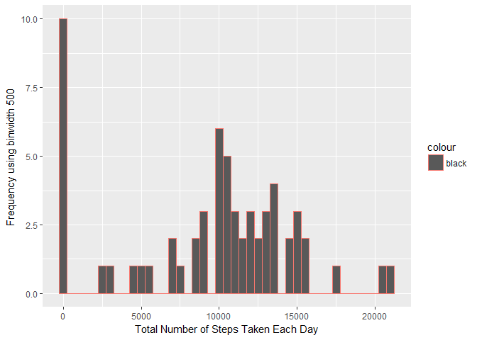

# REPRODUCIBLE RESEARCH : PEER GRADED ASSIGNMENT 1

## Loading the required libraries

```r
library(ggplot2)
```

```
## Warning: package 'ggplot2' was built under R version 3.3.2
```

```r
library(Hmisc)
```

```
## Warning: package 'Hmisc' was built under R version 3.3.2
```

```
## Loading required package: lattice
```

```
## Loading required package: survival
```

```
## Warning: package 'survival' was built under R version 3.3.2
```

```
## Loading required package: Formula
```

```
## Warning: package 'Formula' was built under R version 3.3.1
```

```
## 
## Attaching package: 'Hmisc'
```

```
## The following objects are masked from 'package:base':
## 
##     format.pval, round.POSIXt, trunc.POSIXt, units
```

```r
library(lubridate)
```

```
## Warning: package 'lubridate' was built under R version 3.3.2
```

```
## 
## Attaching package: 'lubridate'
```

```
## The following object is masked from 'package:base':
## 
##     date
```

```r
library(reshape2)
```

```
## Warning: package 'reshape2' was built under R version 3.3.2
```

## Loading the data

```r
if(!file.exists('activity.csv')) {
unzip('activity.zip')
}
actdata <- read.csv("E:/Documents/Coursera/Reproducible Research/activity.csv")
```

## Process/transform the data (if necessary) into a format suitable for your analysis

```r
actdata$intervals <- strptime(gsub("([0-9]{1,2})([0-9]{2})","\\1:\\2", actdata$interval),
                          format = '%H:%M')
```

## What is mean total number of steps taken per day?

```r
stepsbyday <- tapply(actdata$steps,actdata$date,sum, na.rm=TRUE)
qplot(stepsbyday, xlab = "Total Number of Steps Taken Each Day",
      ylab = "Frequency using binwidth 500 ", binwidth=500 , col = "black")
```

<!-- -->

## Mean and median number of steps taken each day

```r
stepsbydaymean <-  mean(stepsbyday)
stepsbydaymedian <-  median(stepsbyday)
```

Mean : 9354.2295082

Median : 10395

## Time series plot of the average number of steps taken

```r
avgstepspertimeinterval <- aggregate(x=list(meansteps=actdata$steps),
                                     by=list(interval=actdata$interval),
                                     FUN = mean, na.rm = TRUE)
qplot(x=interval,y=meansteps, data = avgstepspertimeinterval)+geom_line()+ xlab("5 min Time Interval")+ ylab("Average Number of Steps Taken")
```

<!-- -->

## The 5-minute interval that, on average, contains the maximum number of steps

```r
avgstepspertimeinterval[which.max(avgstepspertimeinterval$meansteps),]
```

```
##     interval meansteps
## 104      835  206.1698
```

## Code to describe and show a strategy for imputing missing data

```r
missing <- is.na(actdata$steps)
summary(missing)
```

```
##    Mode   FALSE    TRUE    NA's 
## logical   15264    2304       0
```

```r
### Code for imputing data
actdataimputed <- actdata
actdataimputed$steps <- impute(actdataimputed$steps, fun = mean)
```

## Histogram of the total number of steps taken each day after missing values are imputed

```r
stepsbydayimputed <- tapply(actdataimputed$steps,actdataimputed$date,sum)
qplot(stepsbydayimputed,xlab = "Total Number of Steps Taken Each Day",
      ylab = "Frequency using binwidth 500 ", binwidth=500 , col = "black")
```

<!-- -->

```r
stepsbydayimputedmean <- mean(stepsbydayimputed)
stepsbydayimputedmedian <- median(stepsbydayimputed)
```
Mean (Imputed)   : 1.0766189\times 10^{4}

Median (Imputed) : 1.0766189\times 10^{4}

## Panel plot comparing the average number of steps taken per 5-minute interval across weekdays and weekends

```r
actdataimputed$dateType <-  ifelse(as.POSIXlt(actdataimputed$date)$wday %in% c(0,6), 'weekend', 'weekday')
avgstepspertimeintervalimputed <- aggregate(steps~interval+dateType, data = actdataimputed,mean)
ggplot(data = avgstepspertimeintervalimputed,aes(interval,steps))+geom_line()+
      facet_grid( dateType ~ .)+xlab("5 minutes Interval")+ ylab("Average Number of Steps")
```

<!-- -->
